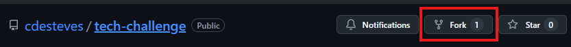
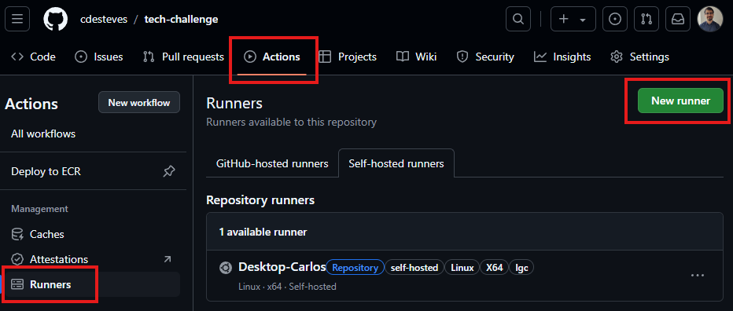
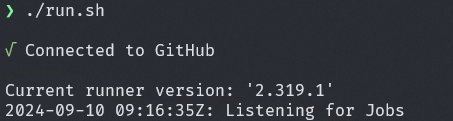

# DevOps Challenge:

## Overview

This repository demonstrates a CI/CD pipeline to deploy a simple web application (using an NGINX Docker image) to a local Kubernetes cluster. The pipeline automates building a Docker image, pushing it to AWS Elastic Container Registry (ECR), and deploying it using Helm to a Minikube Kubernetes cluster.

## Technologies Used

- **Docker**: To build and run the web application (NGINX with a custom `index.html`).
- **Minikube**: Local Kubernetes cluster used for deployment.
- **Helm**: For managing Kubernetes deployments.
- **GitHub Actions**: Automates the CI/CD process, including Docker image builds and Kubernetes deployments.
- **AWS ECR**: Stores the Docker image.
- **Docker Desktop with WSL (Ubuntu)**: Development environment for running containers and Kubernetes on Windows.

## Prerequisites

Before you can run this project locally or interact with the GitHub Actions CI/CD pipeline, ensure you have the following installed and set up:

- **Minikube** (for the local Kubernetes cluster)
- **kubectl** (Kubernetes command-line tool)
- **Helm** (Kubernetes package manager)
- **GitHub account** (to use GitHub Actions)
- **ECR repository** (to store the docker image)
- **If using  Windows**:
  - **WSL** (Ubuntu) 
  - ***Docker Desktop*** (with WSL integration on Windows)

## Project Setup

## Fork the Repository

In order to add your own secrets and self-hosted runner, there is the need to fork this repository: 



## Minikube Setup
To deploy the application to your local Kubernetes cluster, start Minikube:

- Start Minikube:
```bash
minikube start
```

## ECR credentials

You need to configure your ECR credentials in the following locations:

  - **GitHub Secrets**: so that the pipeline is able to push the new image to the repository.
  - **minikube**: so that the cluster is able to retreive the docker image. 

In Minikube, the credentials are configured using the registry-creds addon.

To configure it, run the following command: 
 ```bash
minikube addons configure registry-creds
```
Configure the registry-creds addon with the your details for AWS ECR: 

  - **AWS_ACCESS_KEY_ID**
  - **AWS_SECRET_ACCESS_KEY**
  - **AWS_REGION**
  - **AWS_ACCOUNT**

Afterwards, enable it via: 
```bash
minikube addons enable registry-creds
```
##  Self-hosted runner

To configure the self-hosted runner, navigate to "Actions" in your GitHub repository, then select "Runners", and click "New runner". Follow the on-screen instructions:



From there, select "new self-hosted runner" and you will be prompt with the GitHub tutorial. 

After following all steps, run the final command to start the runner that should be idle and waiting for jobs, like so: 




### Configre AWS CLI

Since we are using a self-hosted GitHub runner, you need to configure the AWS CLI with appropriate credentials that the runner will use to interact with ECR.

For this, run: 

```bash
aws configure
```

And enter the desired credentials. Note that these should have permissions to interact with ECR. 


## CI/CD Pipeline
The GitHub Actions workflow is set up to automate the following steps:

1. Build: Builds the Docker image for the web application.
2. Push: Pushes the Docker image to AWS ECR.
3. Deploy: Uses Helm to deploy the application to the Kubernetes cluster running on Minikube.

The workflow is triggered automatically on every code push to the repository. 

To set up the secrets for AWS ECR, you need to add the following GitHub Secrets:

- AWS_ACCESS_KEY_ID
- AWS_SECRET_ACCESS_KEY
- ECR_REPOSITORY (ECR repository URL where the image will be pushed)


GitHub Actions Workflow Overview
The GitHub Actions pipeline (.github/workflows/main.yml) performs the following key steps:

- Checkout: Pulls the code from the repository.
- Build: Builds the Docker image.
- Authenticate: Logs into AWS ECR using credentials stored in GitHub Secrets.
- Push: Pushes the image to ECR.
- Deploy: Uses Helm to deploy the application to the Minikube cluster.


## Deploying

Once all prerequisites are installed and configured, you can trigger the pipeline by pushing any code change to the repository. 

The Self-hosted runner will update the ECR image and afterwards deploy using helm into the minikube cluster. 

### Accessing the Application

Once the application is deployed to the Kubernetes cluster, you can access it by using the Minikube IP and the service’s NodePort:

```bash
minikube service lgc --url --namespace lgc
```
This will open the web application in your default browser.


## Enhancements

### Monitoring and Logging
For monitoring and logging, tools like Prometheus and Grafana can be installed in the Minikube cluster. This can help monitor the health and performance of your deployed application.
